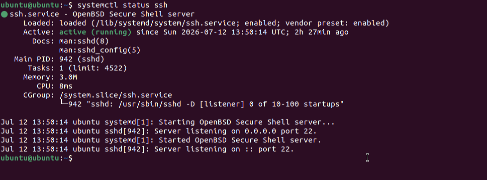
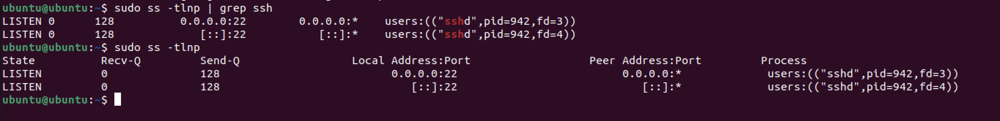
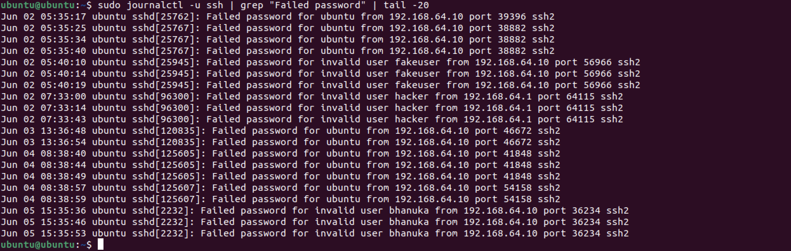

# SSH Security Audit

## Objective

Assess the security configuration of the OpenSSH service running on the Ubuntu virtual machine.

---

## Commands Used

```bash
systemctl status ssh

sudo ss -tlnp | grep ssh

sudo grep "^PermitRootLogin" /etc/ssh/sshd_config

sudo grep "^PasswordAuthentication" /etc/ssh/sshd_config

sudo journalctl -u ssh | grep "Failed password" | tail -20

systemctl is-enabled ssh

who

w
```

---

## Findings

### SSH Service

SSH service was active and enabled.



---

### Listening Port

SSH was listening on TCP port 22.



---

### Root Login

Root login configuration was reviewed.


---

### Password Authentication

Password authentication settings were verified.

---

### Failed Login Attempts

Multiple failed login attempts were recorded.

Examples included:

- Invalid username
- Incorrect password attempts

These events were successfully detected through the system journal.



---

## Security Risks

- Password authentication can be targeted by brute-force attacks.
- Failed login attempts indicate that unauthorized access attempts are possible.
- Monitoring SSH logs is essential for detecting suspicious activity.

---

## Recommendations

- Disable root login.
- Use SSH key authentication where possible.
- Install Fail2Ban to block repeated failed login attempts.
- Keep SSH updated.
- Restrict SSH access using a firewall.

---

## Risk Rating

Medium
