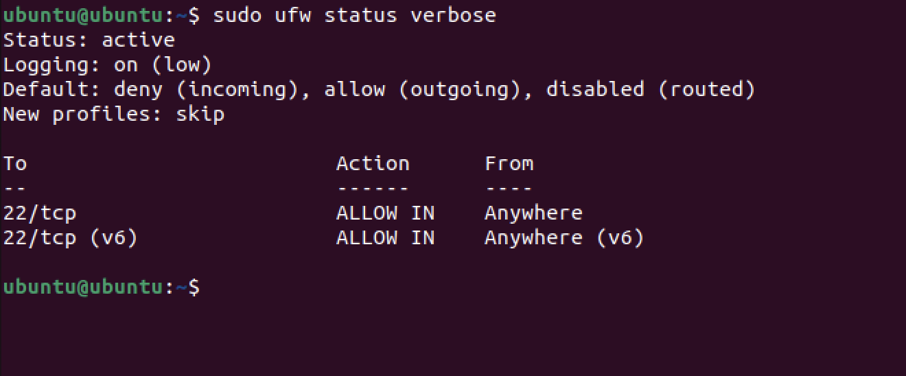
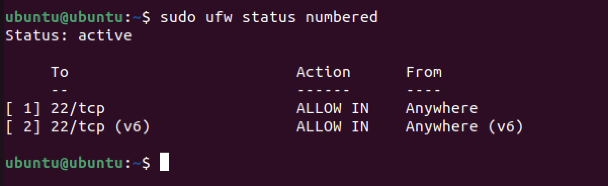
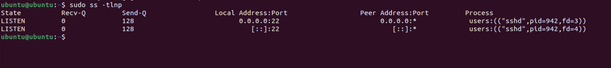
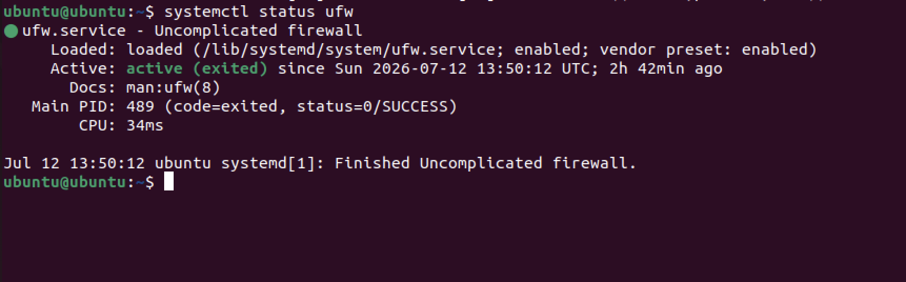

# Firewall Audit

## Objective

Review the Ubuntu Uncomplicated Firewall (UFW) configuration and verify that only necessary network access is permitted.

---

## Commands Used

```bash
sudo ufw status verbose
sudo ufw status numbered
systemctl status ufw
sudo ss -tlnp
```

---

## Findings

### Firewall Status

The firewall is active and configured to deny incoming connections by default while allowing outgoing traffic.



---

### Firewall Rules

SSH (TCP port 22) is explicitly allowed to permit remote administration.



---

### Open Ports

Only required services were observed listening on the system.



---

### UFW Service

The firewall service is active.



---

## Security Assessment

The firewall follows a secure default-deny approach for inbound traffic while allowing SSH access for remote administration.

## Recommendations

- Allow only required ports.
- Remove unnecessary firewall rules.
- Regularly review open services.
- Monitor firewall logs.

## Risk Rating

Low
