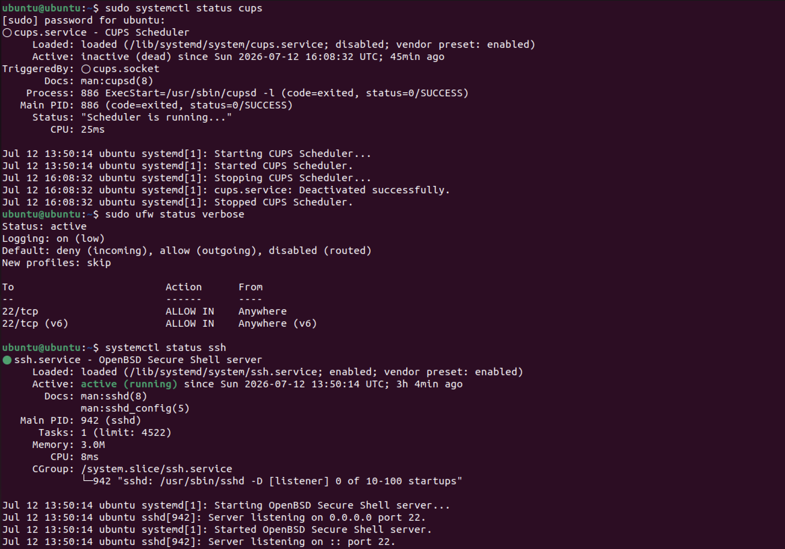

# Security Hardening Summary

## Objective

This document summarizes the security improvements implemented during the Ubuntu Server Security Audit project.

---

## Security Improvements

### 1. Disabled Unnecessary Service (CUPS)

The CUPS printing service was identified as unnecessary for this server.

Action Taken:

- Service stopped
- Service disabled

Security Benefit:

- Reduces attack surface
- Prevents unnecessary network exposure

---

### 2. Firewall Enabled

UFW was configured with a default-deny policy.

Action Taken:

- Enabled UFW
- Allowed SSH (TCP 22)
- Blocked all other unsolicited inbound traffic

Security Benefit:

- Protects against unauthorized network access
- Limits exposed services

---

### 3. SSH Review

SSH configuration was reviewed.

Verified:

- SSH service running
- Listening on TCP Port 22
- Authentication logs reviewed
- Failed login attempts analyzed

Security Benefit:

- Ensures secure remote administration
- Detects unauthorized login attempts

---

### 4. User Audit

Verified:

- Current users
- Sudo group membership
- Login history
- Password aging policy

Security Benefit:

- Prevents privilege misuse
- Identifies inactive or suspicious accounts

---

### 5. Service Audit

Reviewed enabled services.

Disabled unnecessary printing service.

Security Benefit:

- Smaller attack surface
- Improved system performance

---

### 6. Network Audit

Verified:

- IP configuration
- Routing table
- Listening ports

Security Benefit:

- Confirms expected network configuration
- Detects unexpected services

---

## Final Verification

---

## Overall Risk

Initial Risk:

Medium

Final Risk:

Low

---

## Conclusion

The Ubuntu virtual machine was successfully audited and hardened by removing unnecessary services, enabling firewall protection, verifying SSH security, reviewing user accounts, and documenting the final secure configuration.
